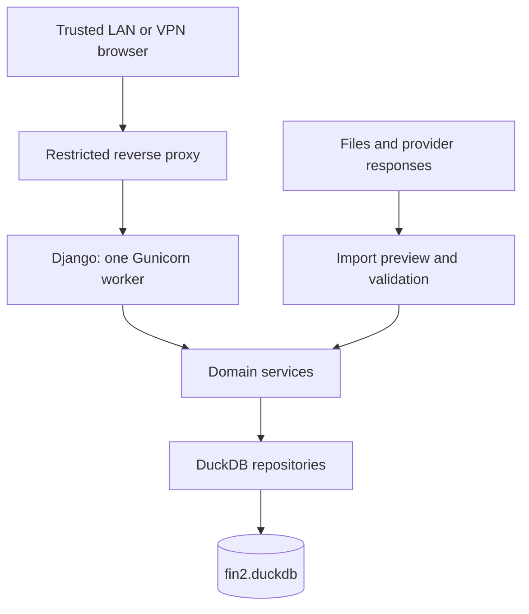

# Architecture

## Components

Django handles HTTP, forms, validation, templates, and CSRF. Domain services coordinate operations; repositories own SQL and database access. Analytics exposes calculated results to the dashboard without embedding financial rules in templates.

Use Django without auth, admin, session middleware, or ORM-backed application models. Do not add SQLite to satisfy scaffold defaults. HTMX is planned; select the chart library when building the first real dashboard.

## Database ownership

The planned runtime uses the official DuckDB Python client with one Gunicorn worker and initially four request threads. A process-wide lock serializes writes. Connections/cursors must be managed per thread; do not share an active cursor between requests.

A Python lock does not coordinate separate processes. Until a coordinated job design exists, management commands that open the database must run in a maintenance window with the web service stopped. Do not launch independent scheduled writers against the live database. Do not use overlapping worker reloads or multiple application instances with the same database file.

Apply writes in explicit transactions. Keep network fetching and parsing outside the write lock where possible, then validate and commit atomically. Reads must see consistent committed results. Connection lifetime, shutdown, locking, and failure rollback require tests before enabling mutations.

Initial resource targets are a 1 GB DuckDB memory limit, two DuckDB execution threads, and a dedicated temporary directory. These are starting budgets, not a guarantee of total process memory usage; measure within the LXC.

## Data and configuration

Store master data, ledger events, market observations, and import metadata in DuckDB. Store credentials and filesystem settings in environment/configuration files outside the checkout. Store original documents separately, linked by provenance metadata.

Corrections append reversal or adjustment events. Do not silently overwrite financial history. Imported position snapshots support reconciliation and must not be counted again as ledger activity.

## Backups

The initial safe procedure is to stop all database users, close connections cleanly, copy the database and associated source files, and restart the service. Never assume a copy of an actively written database file is a valid backup. Verify restores in an isolated location before relying on the backup process.
