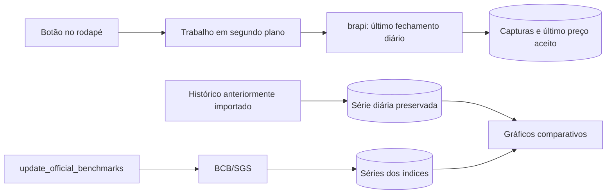

# Atualização de preços de ativos e índices

Este documento descreve o funcionamento atualmente implementado no Fin2. Há
três fluxos independentes: último fechamento dos ativos, histórico diário de
fechamento dos ativos e séries históricas dos índices. O botão de atualização
do rodapé executa somente o primeiro fluxo.

## Visão geral

| Informação | Fonte | Período | Frequência | Como é acionada |
|---|---|---|---|---|
| Último fechamento e lacunas recentes dos ativos | brapi v2 | Até três meses, conforme o plano gratuito | Diária | Botão **Atualizar preços** no rodapé |
| Histórico de ativos | COTAHIST/B3 e capturas legadas da brapi v2 | Desde a primeira compra registrada | Diária | `scripts.import_b3_history` |
| CDI, Selic, IPCA, dólar e euro | SGS do Banco Central do Brasil | Desde 01/01/2000 | Diária ou mensal, conforme a série | `scripts.update_official_benchmarks` |
| Ibovespa | B3, estatísticas oficiais de índices | Desde 03/01/2000 | Diária | `scripts.update_b3_ibovespa` |

O histórico do Ibovespa no SGS está descontinuado e cobre apenas parte do
período. Os arquivos históricos oficiais da B3 completam a série e prevalecem
nas datas coincidentes. O Fin2 não interpola lacunas nem cria valores sintéticos.



## Configuração e segredo da brapi

O token deve ser informado como `BRAPI_TOKEN` no arquivo `.env` da raiz do
projeto. O carregador de configuração lê esse arquivo sem substituir uma
variável que já exista no ambiente do processo. O `.env` não é versionado.

O token é enviado no cabeçalho HTTP `Authorization: Bearer ...`. Ele não é
incluído no URL, no banco, nos relatórios nem nas mensagens da interface. Os
valores reais do `.env` nunca devem ser acrescentados à documentação ou ao Git.

## Mecanismo por ativo

Cada ativo possui um mecanismo explícito em
`market.asset_price_update_method`. Os valores aceitos inicialmente são:

- `BRAPI`: entra na verificação e, se ainda não estiver atualizado no dia, é
  consultado na brapi;
- `NENHUM`: fica fora da atualização automática e da verificação global.

Se um ativo `BRAPI` produzir o erro **Ticker fora do formato suportado**, o
Fin2 muda seu mecanismo automaticamente para `NENHUM`. Essa classificação fica
registrada no histórico do trabalho e o ativo deixa de bloquear o sucesso do
ciclo ou entrar em atualizações futuras.

A migração atribui `BRAPI` a todos os ativos existentes, e novos ativos também
recebem esse mecanismo. A página de cotações permite alterá-lo para `NENHUM`.
O disparo pelo rodapé sempre considera todos os ativos `BRAPI` do lote,
independentemente do filtro de carteira exibido na página.

## Último fechamento pelo botão do rodapé

Ao pressionar o botão **Atualizar preços**, a interface envia uma requisição
`POST` ao Fin2. O servidor cria um registro durável em `price_update_job` e
inicia uma thread em segundo plano. A página continua utilizável e consulta o
estado do trabalho periodicamente. Ao terminar, o Fin2 exibe uma notificação
assíncrona e atualiza a data mostrada na barra de status.

Durante a execução, o mesmo botão muda para **Cancelar atualização**. O pedido
não exige confirmação, é persistido imediatamente e impede novas consultas
assim que o trabalhador alcança o próximo ponto seguro. Uma resposta da
consulta que já estava em andamento ainda é validada e gravada. Essa chamada
tem timeout de cinco segundos, evitando que o cancelamento permaneça preso a
uma consulta pendente por mais tempo.

Se houver uma carteira selecionada, somente os ativos dessa carteira entram no
trabalho. Sem filtro de carteira, o lote inteiro é considerado. São elegíveis
apenas ativos que satisfaçam todos estes critérios:

- provedor configurado como `atuBrAPI`;
- moeda legada `REAL` ou `BRL`;
- multiplicador igual a 1;
- ticker único no lote e no formato brasileiro suportado, como `PETR4` ou
  `TAEE11`.

Os demais ativos são contabilizados como ignorados. Cada elegível é consultado
isoladamente no endpoint histórico diário da brapi, respeitando o limite de um
ticker por chamada do plano gratuito. A resposta cobre até três meses, e o Fin2
seleciona o fechamento da data de pregão mais recente. Ticker solicitado e
devolvido devem coincidir; o intervalo deve ser diário e o preço precisa ser
positivo e finito.

Os demais fechamentos presentes na mesma resposta são usados para completar
lacunas dos últimos três meses em `market.daily_close`. Um pregão já armazenado
é preservado e nunca é sobrescrito por esse fluxo. Portanto, o preenchimento
recente não consome requisições adicionais.

Depois de uma consulta bem-sucedida, o Fin2 espera cinco segundos antes de
consultar o próximo ativo. O resultado recém-gravado é mostrado imediatamente
na barra de status e permanece visível durante essa espera, sem uma mensagem
intermediária. Um ativo que já tenha uma consulta
bem-sucedida na data corrente, considerada no fuso `America/Sao_Paulo`, é
retirado da fila sem nova chamada à brapi.

A resposta original é guardada em `external_quote_capture`, junto com SHA-256,
endpoint, horário, interpretação e estado `accepted` ou `rejected`. A view
`market.quote_capture` expõe essas evidências.
`market.asset_price_query_success` registra a data e a hora de cada consulta
bem-sucedida, mesmo quando o fechamento e a resposta não mudaram. A view
`market.latest_external_price` escolhe o resultado da consulta mais recente de
cada ativo. Uma resposta idêntica reutiliza a captura original; uma resposta
diferente permanece como nova evidência.

Somente um trabalho pode escrever por vez no processo. Se o serviço for
reiniciado durante uma atualização, o trabalho interrompido é marcado como
falho na próxima solicitação. Falhas em um ativo não impedem a tentativa dos
ativos seguintes. O resumo final informa quantos ativos foram aceitos,
rejeitados, ignorados ou falharam.

A data **Última atualização de preços** no rodapé é o horário da última consulta
bem-sucedida de todo o conjunto. Ela somente avança quando todos os ativos
configurados como `BRAPI` estão atualizados. Se qualquer ativo falhar, a data é
preservada e a barra de status apresenta a lista dos ativos com falha. Ela não
representa a última carga das séries históricas ou dos índices.

## Histórico diário de fechamento dos ativos

O Fin2 preserva as séries históricas já armazenadas em `market.daily_close` e
completa lacunas que estejam dentro da janela de três meses devolvida junto com
o último fechamento. Ele não faz cargas de períodos anteriores pela brapi. O comando
`scripts.update_price_history` foi desativado para garantir que a integração
use o provedor exclusivamente para obter o fechamento mais recente.

As séries existentes mantêm:

- data do pregão;
- moeda BRL;
- fechamento (`close`);
- fechamento ajustado (`adjusted_close`), quando fornecido;
- provedor, captura de origem e horário da captura.

Os bytes originais e seu SHA-256 ficam em `market.history_capture`. Os pontos
ficam em `market.daily_close`, com uma chave única por ativo, data e provedor.
Fins de semana e feriados não possuem linhas artificiais. Uma futura retomada
da carga histórica deverá usar uma fonte compatível com a política do projeto,
sem ampliar o uso da brapi além do último fechamento.

A view `market.daily_close_series` acrescenta ticker e nome. Nos gráficos de
retorno, o Fin2 usa preferencialmente o fechamento ajustado, pois ele contempla
eventos corporativos refletidos pelo provedor.

## Índices oficiais

O comando `scripts.update_official_benchmarks` consulta a API SGS do Banco
Central. Todas as séries começam em 01/01/2000 e são divididas em janelas de no
máximo nove anos, reduzindo o tamanho de cada resposta.

```bash
cd /home/mcsil/projects/Fin2
.venv/bin/python -m scripts.update_official_benchmarks \
  --database "$HOME/Fin2-private/development/fin2.duckdb" \
  --batch ID_DO_LOTE
```

| Índice no Fin2 | Código SGS | Unidade armazenada | Frequência |
|---|---:|---|---|
| CDI | 12 | percentual ao dia | Diária |
| Selic | 11 | percentual ao dia | Diária |
| IPCA | 433 | percentual ao mês | Mensal |
| Dólar/real | 1 | BRL por USD | Diária |
| Euro/real | 21619 | BRL por EUR | Diária |
| Ibovespa | 7 | pontos do índice | Diária, com cobertura incompleta |

As respostas originais ficam em `market.benchmark_capture`; as observações,
em `market.benchmark_value`. A chave por índice, data e provedor impede
duplicação, e uma captura posterior pode substituir o valor do mesmo dia. A
frequência original é preservada: por exemplo, o IPCA mensal não é convertido
artificialmente em uma série diária.

O comando antigo `scripts.update_benchmark_history` não realiza mais consultas.
Para CDI, Selic, IPCA e câmbio, o procedimento operacional adotado é o adaptador
oficial do BCB. O Ibovespa é complementado pelos arquivos anuais oficiais
da B3.

## Uso nos gráficos

A view `market.comparison_series` reúne o fechamento ajustado dos ativos e as
observações dos índices. A página de histórico normaliza cada série para
comparar sua evolução no período escolhido. O filtro de ano limita o intervalo
do gráfico; sem ele, a consulta começa em 01/01/2000. Podem ser exibidas até oito
séries simultaneamente.

## Integridade, falhas e repetição segura

As integrações limitam cada resposta a 1 MiB e usam timeout de rede. O adaptador
brapi não segue redirecionamentos, evitando encaminhar o token a outro endpoint.
Erros HTTP, falhas de conexão e respostas incompatíveis são relatados sem gerar
preços sintéticos.

As cargas históricas gravam a captura e seus pontos dentro de uma transação. Se
a validação ou a escrita falhar, a transação correspondente é revertida. Os
identificadores das capturas derivam do conteúdo e os pontos possuem chaves
únicas; por isso, repetir os comandos serve tanto para manutenção diária quanto
para preencher pregões que antes estavam ausentes.

Antes de executar os comandos diretamente em produção, deve-se confirmar o
backup do arquivo DuckDB e impedir duas rotinas de escrita simultâneas. O botão
da aplicação já serializa os trabalhos iniciados pela interface, mas não
coordena processos externos executados pelo terminal.

## Limites atuais

- O botão do rodapé atualiza o último fechamento e preenche lacunas dos três
  meses retornados; ele não recupera períodos anteriores nem atualiza índices.
- O histórico antigo dos ativos é carregado explicitamente dos arquivos anuais
  COTAHIST; o botão atualiza somente o período recente.

## Decisão de agendamento

Decisão registrada em 07/09/2026: nenhum fluxo de preço ou índice será executado
por um processo agendado independente.

- O fechamento recente pela brapi continua sob comando manual no dashboard. O
  trabalho roda dentro do único processo web, respeita o intervalo do provedor,
  permite cancelamento e compartilha o bloqueio de escrita do DuckDB.
- CDI, Selic, IPCA e câmbio pelo BCB continuam como manutenção explícita. O
  comando reconsulta todo o período desde 2000 e abre o banco em outro processo;
  deve ser executado com backup e serviço parado.
- O Ibovespa e o histórico antigo dos ativos dependem de arquivos oficiais anuais
  da B3. Eles são importados quando um novo arquivo é obtido e verificado.

Um agendamento futuro exige primeiro um coordenador único de escrita entre o
serviço e comandos externos, além de atualização incremental dos índices. Até
lá, timers separados poderiam disputar o arquivo DuckDB ou interromper um trabalho
da interface.
- Ativos sem ticker inequívoco, com moeda ou multiplicador incompatível, ou sem
  suporte do provedor permanecem sem cotação externa.
- A série descontinuada do SGS permanece como evidência; a projeção efetiva do
  Ibovespa usa os arquivos anuais da B3.
- Uma cotação `accepted` passou pelas validações técnicas, mas ainda pode estar
  defasada se o provedor devolver um horário antigo. O horário da própria
  cotação é preservado para essa análise.

## Arquivos principais

- `fin2/portfolio/brapi.py`: consulta e validação do último fechamento;
- `fin2/portfolio/price_jobs.py`: trabalho assíncrono iniciado pela interface;
- `fin2/portfolio/price_history.py`: captura do fechamento diário;
- `fin2/portfolio/bcb_history.py`: captura das séries oficiais do BCB;
- `scripts/update_price_history.py`: comando desativado que impede nova carga
  histórica pela brapi;
- `scripts/update_official_benchmarks.py`: carga dos índices oficiais;
- `warehouse/migrations/0006_external_quotes.sql`: evidências das cotações;
- `warehouse/migrations/0007_price_update_jobs.sql`: trabalhos e último preço;
- `warehouse/migrations/0037_asset_price_queries.sql`: diário de consultas
  bem-sucedidas;
- `warehouse/migrations/0013_daily_close_history.sql`: histórico diário;
- `warehouse/migrations/0014_benchmark_history.sql`: índices e séries
  comparativas;
- `warehouse/migrations/0015_bcb_benchmarks.sql`: catálogo oficial do SGS.

## Cotações e avaliações manuais

A página `/fin2/cotacoes/manuais/`, disponível em Dados e auditoria e na tela de
Cotações, registra preço por unidade, moeda, data de referência, fonte,
observação e documento opcional. Para bens com quantidade 1, o preço unitário
representa a avaliação integral. A moeda precisa coincidir com a do ativo;
valores positivos são preservados com até dez casas decimais. Datas futuras,
moedas incompatíveis e fontes vazias são rejeitadas.

A migração 0044 cria registros imutáveis em `market.manual_price`, com chave de
idempotência e auditoria. Uma correção é outro registro para a mesma data.
A cotação vigente é a de maior data de referência até o corte, considerando
registros manuais, consultas externas e referências importadas. Empates de data
usam o registro mais recente. O Histórico Fin1 permanece usando a referência
de origem. O cadastro manual não altera o mecanismo BRAPI/NENHUM.

Visão geral, posições, alocação, Conta de Resultado e relatórios passam a usar
essa seleção no corte. A tela de Cotações apresenta a origem `manual`. Ativos
criados no catálogo do Fin2 também passam a integrar o catálogo de preços.
